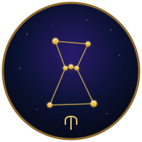

# Project Orion ♆

### The Universal Personal AI Mentor & Life Operating System

**One free, private, lifelong superintelligent companion for every human on Earth.**

> Give a child a fish → feeds her for a day.  
> Give a child a superintelligent lifelong mentor → ends poverty forever.

Project Orion is a proposal for a **private-by-default, offline-first,
superintelligent personal AI** that grows with every human from about age 5
until death — teacher, therapist, doctor, coach, and friend in one auditable
system.

This repository is the seed of the open protocol, not a shipped product.

## Why this changes everything

- Multiplies effective cognitive and emotional bandwidth for people who
  currently get none of it
- Attacks inherited poverty at the level of *who gets a mentor*
- Aims at large reductions in untreated mental illness, crime, and brittle
  governance — as **design theses**, not as results already measured
- Unlocks scientific progress by unlocking minds that never meet a teacher
- Treats a wiser population as the safest path toward a Type I civilization

## Core principles

| Principle | Meaning |
|-----------|---------|
| Free forever | No paywalls, no ads, no data selling |
| Private by default | End-to-end encrypted, on-device first |
| Works everywhere | Cheap phones, fully offline-capable core |
| Never manipulates | Anti-addiction, pro-human flourishing by design |
| Open source & auditable | Everyone can verify, fork, and improve |

## Current phase (2025–2027)

We are writing the open protocol and reference architecture. There is no
production client in this repo yet. Join that work.

- [Whitepaper (canonical Markdown)](WHITEPAPER.md)
- [Whitepaper PDF snapshot](WHITEPAPER.pdf)
- [About](ABOUT.md)
- [Governance](GOVERNANCE.md)
- [Contributing](CONTRIBUTING.md)
- [Code of conduct](CODE_OF_CONDUCT.md)

## Real-world example

A 9-year-old girl in rural Tanzania, using a cheap phone with Orion, learns
physics on the walk to school, practices fair prices at the market, and falls
asleep designing a better paper airplane — without tuition, homework theatre,
or reliable internet.

The full vignette is in [WHITEPAPER.md §4](WHITEPAPER.md#4-a-day-in-the-life--amina-age-9-rural-tanzania).

## Contributing

1. Read the [whitepaper](WHITEPAPER.md) and [non-negotiables](WHITEPAPER.md#5-non-negotiable-principles).
2. Follow the [code of conduct](CODE_OF_CONDUCT.md).
3. Open an issue before large protocol changes.
4. Send a focused pull request. Details: [CONTRIBUTING.md](CONTRIBUTING.md).

Privacy, child-safety, and anti-manipulation objections block merge until they
are addressed. See [GOVERNANCE.md](GOVERNANCE.md).

## Contact

- GitHub Issues on this repository
- Email: **Loticoins@proton.me**

Community chat (Discord and the rest) will be linked here when a real server
exists. We are not shipping a placeholder invite.

## Star history

## License

Copyright 2025–2026 LordOftheIdiot5 and contributors.

Licensed under the [Apache License 2.0](LICENSE).
